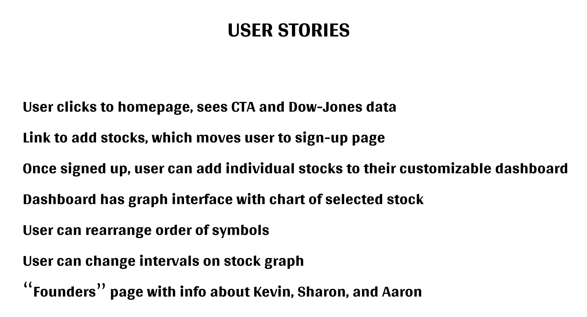
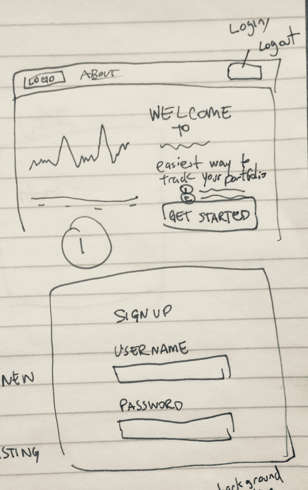
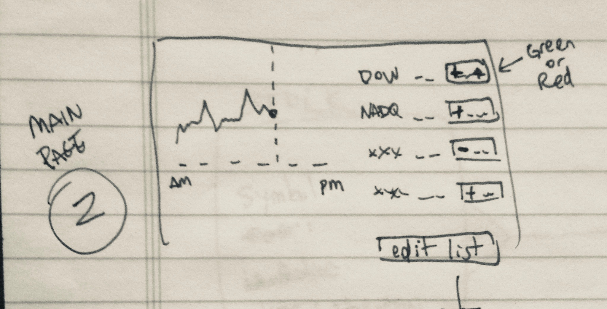
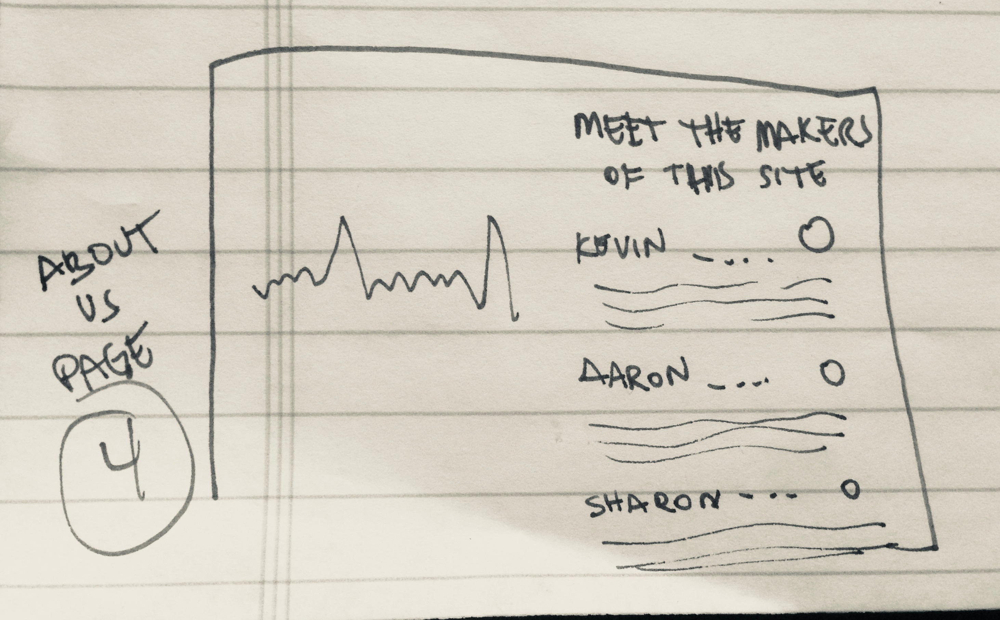

# Stance - Stocks at a glance.

## A project for WDI SF 45 by Kevin Cramer, Aaron Horowitz, and Sharon Paz

Welcome to Stance - Stocks at a glance.

Stance's mission is to deliver up-to-the-minute stock price and chart information, in a simple format, without all of the extra junk found on other stock trading and tracking sites. Stance allows users to sign in and customize the list of stocks on their dashboard, and view historical chart data in increments ranging from one day to five years.

## Find Us On Heroku!

Stance is hosted on Heroku at http://lit-meadow-62962.herokuapp.com/

## Technologies and Libraries
<ul>
We used the following libraries and external data sources for Stance:
<li>AJAX</li>
<li>Bootstrap</li>
<li>D3</li>
<li>Django</li>
<li>Independent Stock Exchange API</li>
<li>jQuery</li>
</ul>

## User Stories

## Wireframes

## Future Plans

<ul>
<li>Ability to show multiple stocks concurrently</li>
<li>Store/save order of stock symbols</li>
<li>Ability to sort stocks alphabetically or by market value</li>
<li>Obtain current index data for Dow/NASDAQ/S&P 500</li>
</ul>

## Contributors

Kevin Cramer: <a href="https://github.com/kecramer">Github</a>

Aaron Horowitz: <a href="https://github.com/aaronhorowitz3">Github</a>

Sharon Paz: <a href="https://github.com/oxleberry">Github</a>
